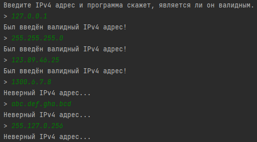

# Объектно-ориентированное программирование, ЛР 2
### Вариант 8
Составить регулярное выражение, определяющее является ли заданная строка IP адресом, записанным в десятичном виде. 
— пример правильных выражений: 127.0.0.1, 255.255.255.0; 
— пример неправильных выражений: 1300.6.7.8, abc.def.gha.bcd.

## Скриншоты работы программы

